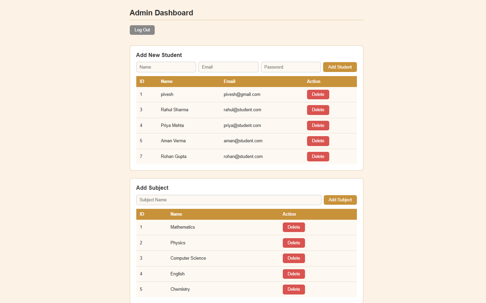
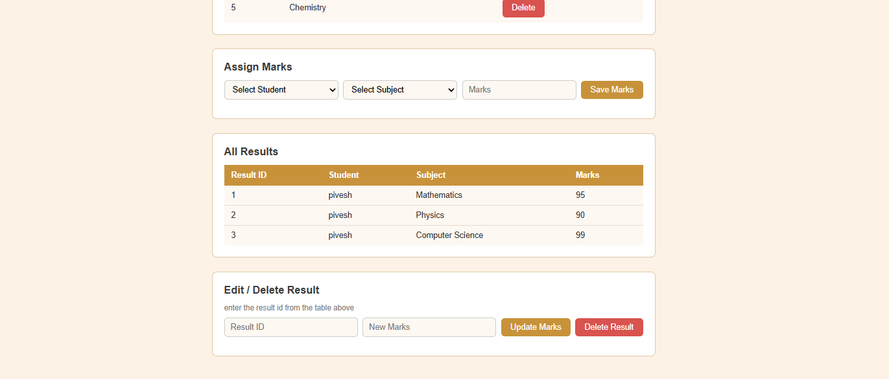
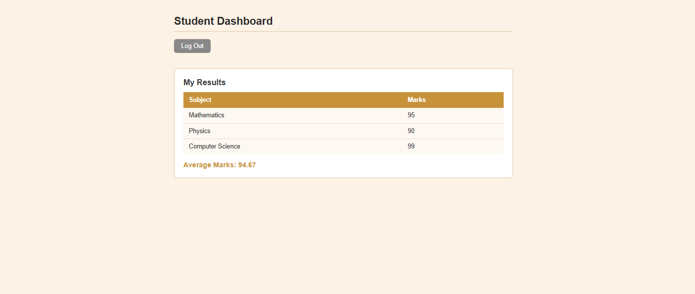

# Student Result Management System

A full stack web application to manage student results.
Built with FastAPI (backend) and React (frontend).

## Tech Stack

- **Backend:** FastAPI, SQLAlchemy, SQLite, JWT Auth
- **Frontend:** React, Axios, React Router

## Project Structure

```
student-result-management/
├── backend/
│   ├── main.py
│   ├── models.py
│   ├── schemas.py
│   ├── auth.py
│   ├── database.py
│   └── requirements.txt
└── frontend/
    └── src/
        ├── App.js
        ├── api.js
        ├── AuthContext.js
        ├── PrivateRoute.js
        ├── Login.js
        ├── AdminDashboard.js
        └── StudentDashboard.js
```
## Screenshots

### Login


### Admin Dashboard 
  



### Student Dashboard
  

## Setup and Run

### Backend

```bash
cd backend
pip install -r requirements.txt
uvicorn main:app --reload  or
fastapi dev main.py  
```

Backend runs at `http://localhost:8000`  
API docs available at `http://localhost:8000/docs`

### Frontend

```bash
cd frontend
npm install
npm start
```

Frontend runs at `http://localhost:3000`

## Features

- JWT based login for admin and student roles
- Admin can add, update, and delete students and subjects
- Admin can assign and update marks
- Student can view their own results and average marks
